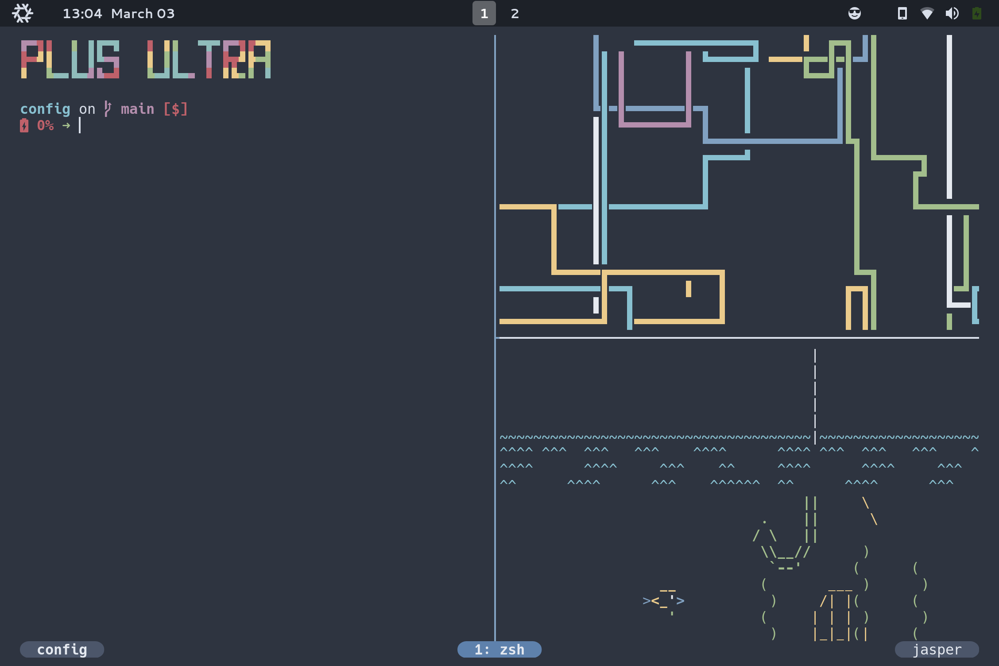
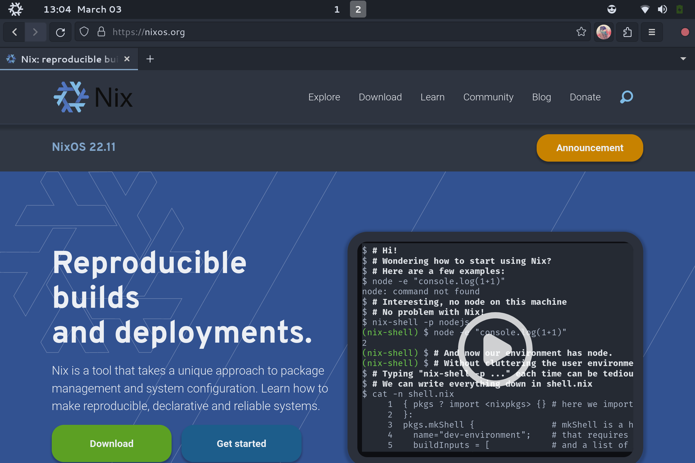

# Plus Ultra

> ✨ Go even farther beyond.

- [Screenshots](#screenshots)
- [Installation](#installation)
  - [Nix Flakes](#nix-flakes)
  - [Cloning Directly](#cloning-directly)
- [Hosts](#hosts)
- [Overlays](#overlays)
- [Options](#options)

## Screenshots






## Installation

There are multiple ways to install and configure your
system using this repository.

- [Nix Flakes](#nix-flakes)
- [Cloning Directly](#cloning-directly)

### Nix Flakes

Add this flake as an input for yours.

```nix
{
  inputs = {
    nixpkgs.url = "nixpkgs/nixos-21.11";

    utils.url = "github:gytis-ivaskevicius/flake-utils-plus";

    plusultra = {
      url = "github:jakehamilton/config";
      inputs.nixpkgs.follows = "nixpkgs";
    };
  };
}
```

Then create your flake output.

```nix
{
  # ...

  outputs = inputs@{ self, nixpkgs, utils, plusultra }:
    utils.lib.mkFlake {
      inherit self inputs lib;
    };
}
```

Next, configure your channels and overlays.

```nix
{
  # ...

  outputs = inputs@{ self, nixpkgs, utils, plusultra }:
    utils.lib.mkFlake {
      # ...

      # You probably want unfree software 😦.
      channelsConfig = { allowUnfree = true; };

      channels.nixpkgs.overlaysBuilder = channels: [
        # Add packages from Plus Ultra.
        plusultra.overlays."nixpkgs/plusultra"
        plusultra.overlays."nixpkgs/kubecolor"
        plusultra.overlays."nixpkgs/discord-chromium"
      ]
        # If you want all overlays from Plus Ultra
        # replace the above lines with this one.
        ++ (plusultra.lib.mkOverlays {} channels)

        # If you have a directory of overlays.
        # See the "Overlays" section for more information.
        ++ (plusultra.lib.mkOverlays { src = ./overlays } channels);
    };
}
```

Finally, add your hosts.

```nix
{
  # ...

  outputs = inputs@{ self, nixpkgs, utils, plusultra }:
    utils.lib.mkFlake {
      # ...

      # See the "Hosts" section for more information.
      hosts = plusultra.lib.mkHosts {
        src = ./machines;

        # Optionally add extra configuration based on machine name.
        hostOptions = {
          "my-hostname" = {
            modules = [ ./my-special-module.nix ];
          };
        };
      };
    };
}
```

Now you can build your new system configuration.

```shell
# On NixOS
sudo nixos-rebuild switch --flake .#my-hostname

# On macOS
sudo darwin-rebuild switch --flake .#my-hostname
```

Done! 🥳

### Cloning Directly

```shell
git clone git@github.com:jakehamilton/config.git
```

Now you can build your new system configuration.

```shell
# On NixOS
sudo nixos-rebuild switch --flake .#my-hostname

# On macOS
sudo darwin-rebuild switch --flake .#my-hostname
```

While this method may be faster, it makes you
responsible for updating versions and fixing conflicts
that will only occur when working off of the
same repository. I heavily recommend using
[Nix Flakes](#nix-flakes) in your own project.

## Hosts

Host machines can be configured using the directory
naming structure `machines/<arch>/<name>` where
`<arch>` is the system architecture (eg. `x86_64-linux`)
and `<name>` is the hostname of the system.

The `lib.mkHost` utility can be used to create system
configuration using the above structure.

```nix
{
  # ...

  outputs = inputs@{ self, nixpkgs, utils, plusultra }:
    utils.lib.mkFlake {
      # ...

      # The output of `mkHosts` is set directly on
      # the `hosts` attribute.
      hosts = plusultra.lib.mkHosts {
        # The `src` directory is your machines directory.
        # If your folder structure is `machines/<arch>/<name>`
        # then the `src` here is `./machines`.
        src = ./machines;
      }
    };
}
```

Each host is expected to have a `default.nix` file
in its directory. This is the only file that will be
imported for the host, so you can safely have other
files in the directory. Hardware configuration is a
good example of a second config file to have co-located.

The overall structure may look like the following.

```
. (root)
|
|-- machines/
|   |-- x86_64-linux/ (or the name of your arch)
|       |-- default.nix
|       |-- hardware.nix (this, and all files other than default.nix, are optional)
```

The `default.nix` file is a standard NixOS
(or nix-darwin) configuration file.

## Overlays

Overlays can be created with the `mkOverlays` helper.
Place overlays in a directory such as `./overlays` and
provide the folder to the `mkOverlays` helper.

**NOTE**: All `*.nix` files within `src` that are **not** named
`default.nix` will be imported.

```nix
{
  # ...

  outputs = inputs@{ self, nixpkgs, utils, plusultra }:
    utils.lib.mkFlake {
      # ...

      channels.nixpkgs.overlaysBuilder = channels: [
        # Individual overlays can be accessed from
        # `plusultra.overlays.<name>`.
        plusultra.overlays."nixpkgs/plusultra"
        plusultra.overlays."nixpkgs/kubecolor"
        plusultra.overlays."nixpkgs/discord-chromium"
      ]
        # To apply all overlays from Plus Ultra.
        ++ (plusultra.lib.mkOverlays {} channels)

        # To add your own overlays, pass the directory
        # where your overlays are. All `*.nix` that are **not**
        # named `default.nix` will be imported.
        ++ (plusultra.lib.mkOverlays { src = ./overlays } channels);
    };
}
```

Overlays for use with `mkOverlay` are designed to take
three arguments: `inputs`, `final`, `prev`. The `inputs`
argument can be particularly useful for getting access to
other channels or flake inputs.

```nix
# `inputs` contains the raw flake inputs, `channels` which
# contains the input channels for the system's architecture,
# `lib` which is the same as `plusultra.lib`, and `pkgs` which
# is the default channel (typically `nixpkgs`).
inputs@{ lib, pkgs, channels, ... }:

final: prev: {
  my-package = pkgs.runCommand {} "my-package" ''
    echo "my cool package" > $out
  '';
}
```

## Options

> _options documentation in progress._
